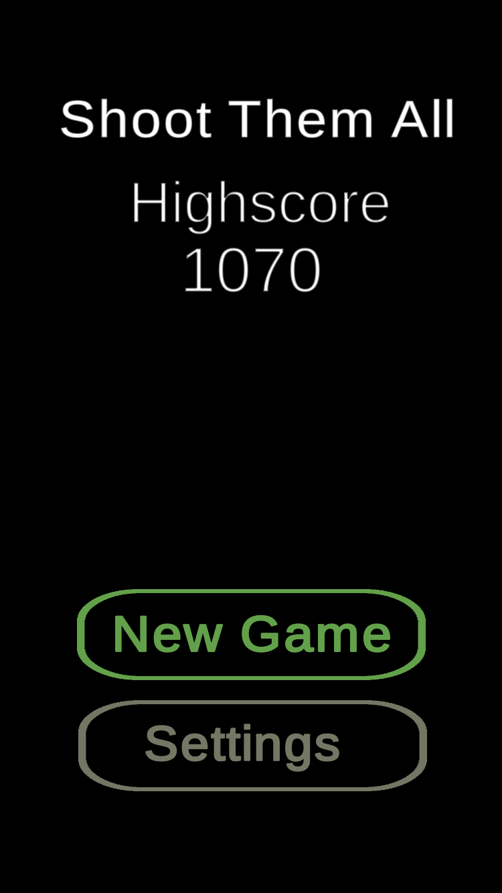
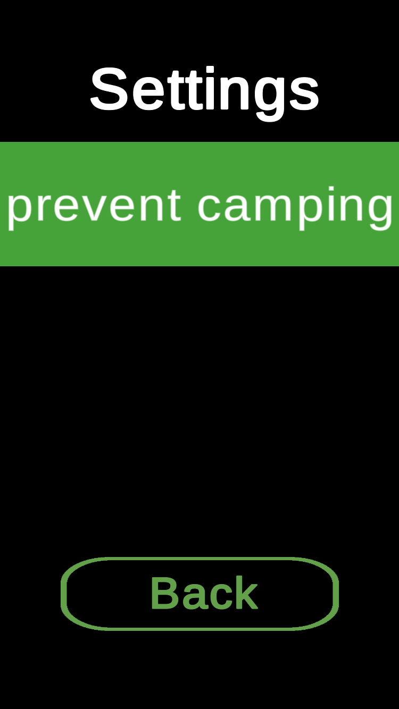
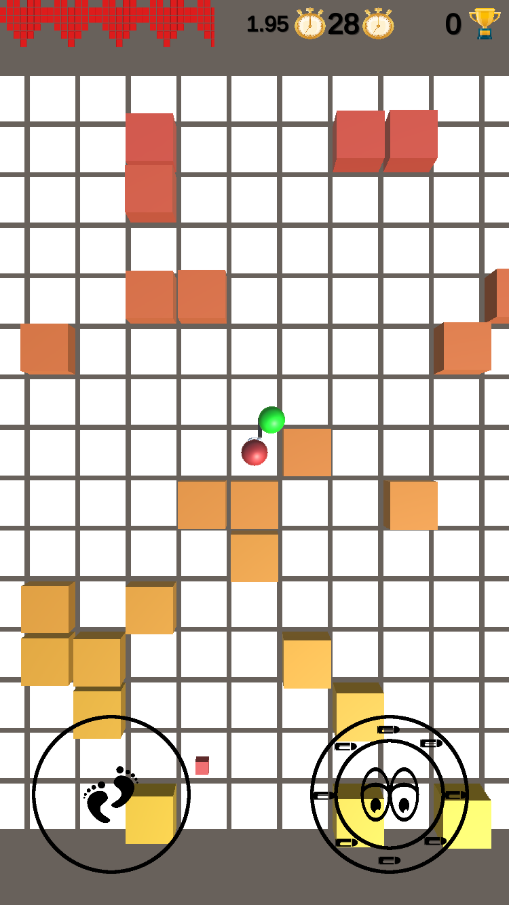
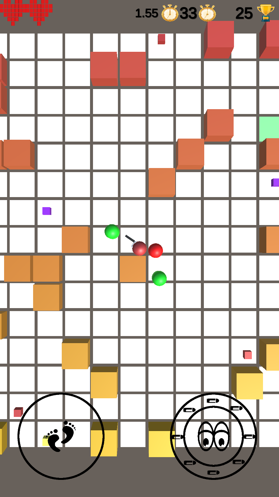
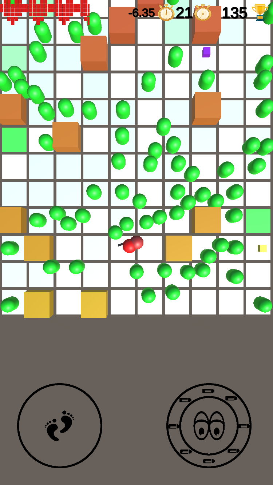

# Arcade Shooter

A topdown shooter, where you need to stay alive for as long as possible.
This game is developed as a playground for me to learn the basics of Unity and to have fun developing a game

## Gameplay
[video](https://www.youtube.com/watch?v=X_FK56TIlUQ)

You enter a map, with randomly spawning enemies.  Defend yourself, manage time, health and enemy spawn rate by collecting different boosts. Stay as long as possible in one level, kill as many enemies as possible, but let the time run out before the enemies overwhelm and kill you.

## Features
### Maps can be generated and configured
- map size
- percentage of obstacles
- height, color of obstacles

### Enemy Spawner
Spawns enemies in a given intervall
- current time between spans: seconds between each enemy spawn
- time increment: time between spawns is reduced by this value every spawn

### Spawn Boost
Increases the time between two enemy spawns
- min remaining time: remaning time to start spawning spawn boosts
- max boosts: number of spawn boosts spawned in parallel
- max total: total number of spawn boosts spawned per level

### Time Boost
Increases time in level by x seconds
- min remaining time: remaning time to start spawning time boosts
- max boosts: number of time boosts spawned in parallel
- max total: total number of time boosts spawned per level

### Health Boost:
Increases players health
- min Health: Health value once a boost will be spawned
- max Health Boosts: number of Health boosts to be spawend in parallel

## Impressions

